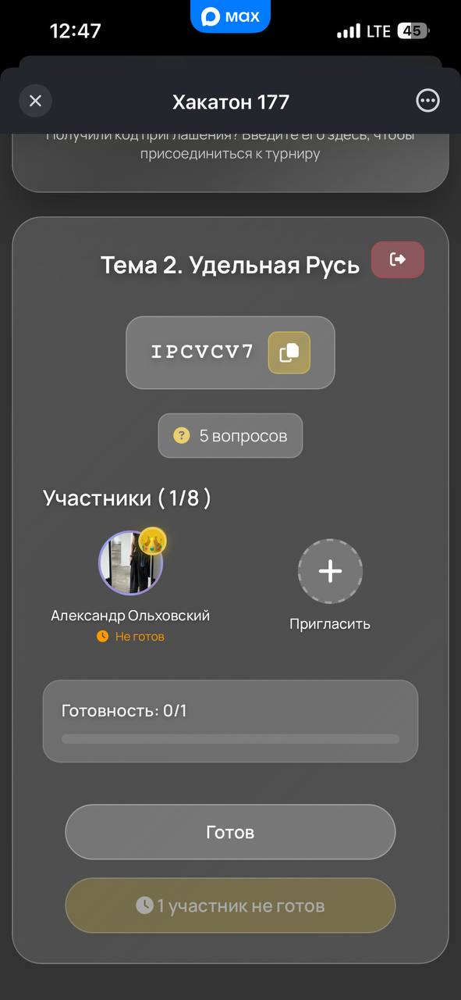
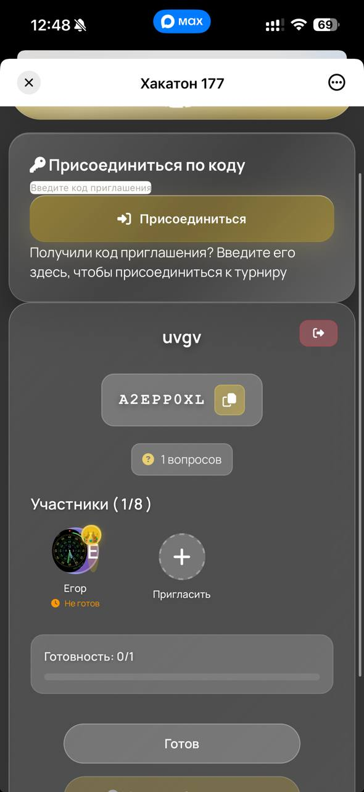

# 🎓 Conspectium — AI-платформа для создания конспектов и тестов

<div align="center">

### ✨ Умная платформа для автоматического создания конспектов из аудио и текста с помощью Google Gemini AI ✨

[](https://fastapi.tiangolo.com/)
[](https://www.postgresql.org/)
[](https://www.python.org/)
[](https://nodejs.org/)
[](https://www.docker.com/)
[](LICENSE)

[🚀 Быстрый старт](#-быстрый-старт) • [📦 Установка](#-установка) • [📚 Документация](#-api-документация) • [🛠️ Разработка](#️-разработка)

</div>

---

## 📋 Содержание

<details>
<summary>📑 Развернуть содержание</summary>

- [🚀 Быстрый старт](#-быстрый-старт)
  - [🐳 Запуск через Docker](#-запуск-через-docker-рекомендуется)
  - [💻 Локальная разработка](#-локальная-разработка-без-docker)
- [✨ Основные возможности](#-основные-возможности)
- [📦 Используемые библиотеки](#-используемые-библиотеки-и-технологии)
- [🗂️ Структура проекта](#️-структура-проекта)
- [🛠️ Разработка](#️-разработка)
- [📚 API документация](#-api-документация)
- [🐛 Решение проблем](#-решение-проблем)
- [🎨 Проблема с отображением стилей в mini app](#-проблема-с-отображением-стилей-в-mini-app-171125)

</details>

---

## 🚀 Быстрый старт

### 🐳 Запуск через Docker (Рекомендуется)

> ⚡ **Самый простой способ** запустить весь проект (сайт + бот) за 3 команды!

#### 📋 Требования

| Компонент | Версия | Проверка |
|-----------|--------|----------|
| Docker | 20.10+ | `docker --version` |
| Docker Compose | 2.0+ | `docker-compose --version` |
| RAM | 2GB+ | - |
| Диск | 5GB+ | - |

#### 🎯 Быстрая установка

```bash
# 1. Клонируйте репозиторий
git clone <repository-url>
cd conspectium-max-bot

# 2. Автоматическая настройка и запуск
./setup-docker.sh && docker-compose up -d
```

**Что делает `setup-docker.sh`:**
- ✅ Создает `.env` из шаблона (если отсутствует)
- ✅ Генерирует `JWT_SECRET_KEY` автоматически
- ✅ Проверяет обязательные переменные

#### ⚙️ Настройка переменных окружения

После запуска скрипта отредактируйте `.env` и укажите:

| Переменная | Описание | Где получить |
|------------|----------|--------------|
| `GOOGLE_API_KEY` | Ключ для обработки аудио | [Google AI Studio](https://makersuite.google.com/app/apikey) |
| `GOOGLE_API_KEY_TEXT` | Ключ для обработки текста | [Google AI Studio](https://makersuite.google.com/app/apikey) |
| `MAX_BOT_TOKEN` | Токен MAX бота | Панель управления MAX |
| `JWT_SECRET_KEY` | Секретный ключ (автогенерация) | Генерируется автоматически |

<details>
<summary>📝 Полный список переменных окружения</summary>

```env
# GOOGLE GEMINI API (ОБЯЗАТЕЛЬНО)
GOOGLE_API_KEY=your_gemini_api_key_for_audio
GOOGLE_API_KEY_TEXT=your_gemini_api_key_for_text
GOOGLE_MODEL=gemini-2.5-flash

# JWT И БЕЗОПАСНОСТЬ (автогенерация)
JWT_SECRET_KEY=  # Генерируется автоматически
SECRET_KEY=      # Генерируется автоматически

# MAX БОТ (ОБЯЗАТЕЛЬНО)
MAX_BOT_TOKEN=your_max_bot_token_here

# НАСТРОЙКИ (опционально)
ENVIRONMENT=production
DATABASE_URL=postgresql://postgres:postgres@db:5432/conspectium
```

</details>

#### 🚀 Запуск

```bash
# Запуск всех сервисов
docker-compose up -d

# Проверка статуса
docker-compose ps

# Просмотр логов
docker-compose logs -f
```

#### 📊 Что происходит при запуске

| Сервис | Описание | Порт |
|--------|----------|------|
| 🗄️ **PostgreSQL** | База данных, автоматические миграции | `5432` (внутренний) |
| 🌐 **Web** | FastAPI приложение, Gunicorn + Uvicorn | `8000` |
| 🤖 **Bot** | MAX бот с hot-reload | - |

> ⏱️ **Время первого запуска:** 3-5 минут

#### ✅ Проверка работы

```bash
# Статус всех сервисов
docker-compose ps

# Проверка здоровья API
curl http://localhost:8000/api/health
# Ожидаемый ответ: {"status":"ok"}
```

#### 🌐 Доступ к приложению

| Сервис | URL |
|--------|-----|
| 🏠 Главная страница | http://localhost:8000/front/html/main.html |
| 📚 Swagger UI | http://localhost:8000/docs |
| 📖 ReDoc | http://localhost:8000/redoc |
| 🤖 MAX бот | Автоматически запускается |

> 💡 **Проверка бота:** `docker-compose logs -f bot` — должно быть `✅ Бот успешно запущен`

---

### 🔧 Полезные команды Docker

<details>
<summary>📦 Управление контейнерами</summary>

```bash
# Остановка/запуск
docker-compose stop          # Остановить (данные сохраняются)
docker-compose start         # Запустить
docker-compose restart       # Перезапустить
docker-compose down          # Остановить и удалить контейнеры
docker-compose down -v       # ⚠️ Удалить ВСЕ данные (БД тоже!)

# Обновление кода
docker-compose up -d --build # Пересобрать и запустить
docker-compose build --no-cache  # Полная пересборка без кеша
```

</details>

<details>
<summary>📊 Мониторинг и логи</summary>

```bash
# Логи
docker-compose logs -f              # Все сервисы
docker-compose logs -f web          # Только веб
docker-compose logs -f bot         # Только бот

# Ресурсы
docker stats                        # Использование ресурсов
docker-compose ps                   # Статус контейнеров
```

</details>

<details>
<summary>🔧 Отладка</summary>

```bash
# Вход в контейнеры
docker-compose exec web bash        # Веб-приложение
docker-compose exec bot sh         # Бот
docker-compose exec db psql -U postgres -d conspectium  # БД

# Миграции вручную
docker-compose exec web python -m alembic upgrade head
docker-compose exec web python -m alembic current
```

</details>

---

### 💻 Локальная разработка (без Docker)

<details>
<summary>🔧 Установка для локальной разработки</summary>

```bash
# 1. Установите Poetry
curl -sSL https://install.python-poetry.org | python3 -

# 2. Установите зависимости
poetry install

# 3. Настройте .env
cp .env.example .env
# Отредактируйте .env (укажите GOOGLE_API_KEY, DATABASE_URL и т.д.)

# 4. Примените миграции
poetry run alembic upgrade head

# 5. Запустите сервер
poetry run uvicorn app.main:app --reload
```

**Требования:**
- Python 3.11+
- PostgreSQL 12+
- Poetry

</details>

---

## ✨ Основные возможности

<div align="center">

### 🎯 Что умеет Conspectium?

</div>

| 🎨 Функция | 📝 Описание |
|------------|-------------|
| 🎤 **Загрузка аудио** | MP3, M4A, WAV, OGG, WebM, AAC — все форматы поддерживаются |
| 🎙️ **Запись с микрофона** | Встроенная запись прямо в браузере |
| 📝 **Создание из текста** | Мгновенная генерация конспекта из текста |
| 🤖 **AI-генерация** | Google Gemini AI для умных конспектов |
| 📋 **3 варианта конспектов** | Полный, краткий, профильный |
| ✅ **Автогенерация тестов** | Тесты из конспектов (1-20 вопросов) |
| 🏆 **Турниры** | Соревнования с друзьями |
| 🔗 **Публичные ссылки** | Делитесь конспектами и тестами |
| 🎮 **MAX бот** | Интерактивный бот в мессенджере |
| 🏅 **Система достижений** | Медали и награды за успехи |

### 🎨 Особенности интерфейса

- ✨ **Современный дизайн** с эффектом "liquid glass"
- 📱 **Мобильная адаптация** (320-480px)
- 🎭 **Плавные анимации** и переходы
- 🌙 **Темная тема** по умолчанию
- 🧭 **Интуитивная навигация**

---

## 📦 Используемые библиотеки и технологии

### 🐍 Python библиотеки (Backend)

Проект использует современный стек Python для создания высокопроизводительного API:

#### **Веб-фреймворк и сервер**
- **FastAPI** (`^0.111.0`) — современный веб-фреймворк для создания API с автоматической документацией, валидацией данных и поддержкой async/await
- **Uvicorn** (`^0.30.0`) — ASGI сервер для запуска FastAPI приложений с поддержкой WebSockets и высокой производительностью
- **Gunicorn** — WSGI HTTP сервер для продакшена, используется в Docker контейнере

#### **База данных и ORM**
- **SQLAlchemy** (`^2.0.30`) — мощный ORM для работы с базами данных, поддерживает асинхронные запросы и сложные связи
- **Alembic** (`^1.13.1`) — система миграций базы данных для SQLAlchemy, позволяет версионировать схему БД
- **psycopg2-binary** (`^2.9.9`) — адаптер PostgreSQL для Python, обеспечивает высокую производительность работы с БД

#### **Валидация и настройки**
- **Pydantic** (через FastAPI) — валидация данных с использованием типов Python, автоматическая генерация схем
- **pydantic-settings** (`^2.3.0`) — управление настройками приложения из переменных окружения и файлов конфигурации

#### **AI и машинное обучение**
- **google-generativeai** (`^0.5.4`) — официальный SDK для работы с Google Gemini AI, используется для генерации конспектов из аудио и текста

#### **Аутентификация и безопасность**
- **PyJWT** (`^2.8.0`) — создание и проверка JWT токенов для аутентификации пользователей
- **passlib** (`^1.7.4`) — библиотека для хеширования паролей с поддержкой различных алгоритмов
- **bcrypt** (`^5.0.0`) — криптографический алгоритм для безопасного хранения паролей

#### **HTTP клиенты**
- **httpx** (`^0.27.0`) — современный асинхронный HTTP клиент для Python, используется для внешних API запросов

#### **Работа с файлами**
- **python-multipart** (`^0.0.9`) — обработка multipart/form-data для загрузки файлов (аудио, изображения)

#### **Инструменты разработки** (dev dependencies)
- **pytest** (`^8.2.0`) — фреймворк для написания и запуска тестов
- **pytest-asyncio** (`^0.23.6`) — поддержка асинхронных тестов в pytest
- **faker** (`^25.0.0`) — генерация тестовых данных
- **ruff** (`^0.4.0`) — быстрый линтер и форматтер для Python
- **black** (`^24.4.2`) — форматтер кода Python
- **mypy** (`^1.9.0`) — статический анализатор типов для Python

### 📦 Node.js библиотеки (MAX Bot)

Бот для мессенджера MAX использует следующие библиотеки:

#### **Основные библиотеки**
- **@maxhub/max-bot-api** (`^0.2.1`) — официальная библиотека для работы с MAX Bot API, обеспечивает взаимодействие с мессенджером MAX
- **dotenv** (`^16.3.1`) — загрузка переменных окружения из `.env` файла для конфигурации бота
- **tamtam** (`^1.0.10`) — дополнительная библиотека для работы с мессенджерами (deprecated, но используется для совместимости)

#### **Встроенные возможности Node.js**
- **fetch API** — встроенный HTTP клиент (Node.js 18+), используется для запросов к веб-API
- **EventEmitter** — для обработки событий бота
- **fs/promises** — асинхронная работа с файловой системой

### 🗄️ База данных

- **PostgreSQL 15** — реляционная база данных для хранения всех данных приложения (конспекты, тесты, пользователи, результаты)

### 🐳 Инфраструктура

- **Docker** — контейнеризация приложения
- **Docker Compose** — оркестрация многоконтейнерного приложения
- **Poetry** — управление зависимостями Python проекта

---

## 🗂️ Структура проекта

```
conspectium-max-bot/
├── 📁 app/                          # Основное приложение
│   ├── 📁 api/                      # API endpoints
│   │   ├── api_v1.py               # Роутер API v1
│   │   ├── deps.py                 # Зависимости (auth, DB)
│   │   └── 📁 endpoints/            # Эндпоинты
│   │       ├── auth.py             # Авторизация
│   │       ├── audio.py            # Загрузка аудио
│   │       ├── conspects.py        # Конспекты
│   │       ├── quizzes.py           # Тесты
│   │       ├── jobs.py              # Задачи генерации
│   │       └── health.py            # Health check
│   ├── 📁 core/                     # Конфигурация
│   │   └── config.py               # Настройки приложения
│   ├── 📁 db/                       # База данных
│   │   └── session.py              # SQLAlchemy session
│   ├── 📁 models/                   # SQLAlchemy модели
│   │   ├── user.py                 # Пользователь
│   │   ├── conspect.py             # Конспект
│   │   ├── quiz.py                 # Тест
│   │   ├── audio.py                # Аудио
│   │   ├── generation.py           # Задачи генерации
│   │   └── enums.py                # Перечисления
│   ├── 📁 schemas/                  # Pydantic схемы
│   │   ├── user.py                 # Схемы пользователя
│   │   ├── conspect.py             # Схемы конспекта
│   │   ├── quiz.py                 # Схемы теста
│   │   └── job.py                  # Схемы задач
│   ├── 📁 services/                 # Бизнес-логика
│   │   ├── auth.py                 # Авторизация
│   │   ├── security.py             # Безопасность (JWT, пароли)
│   │   ├── generation.py           # Генерация конспектов/тестов
│   │   ├── storage.py              # Работа с файлами
│   │   ├── telegram.py             # Интеграция с Telegram
│   │   └── 📁 ai/
│   │       └── gemini.py            # Клиент Google Gemini
│   └── main.py                     # Точка входа FastAPI
│
├── 📁 front/                        # Frontend
│   ├── 📁 html/                     # HTML страницы
│   │   ├── main.html               # Главная
│   │   ├── conspect_create.html    # Создание конспекта
│   │   ├── conspect_list.html      # Список конспектов
│   │   ├── test_create.html        # Создание теста
│   │   ├── test_list.html          # Список тестов
│   │   ├── test.html               # Прохождение теста
│   │   ├── settings.html           # Настройки
│   │   └── ...
│   ├── 📁 js/                       # JavaScript
│   │   ├── app.js                  # Основной API клиент
│   │   ├── script.js               # Общая логика
│   │   ├── conspect_create.js      # Создание конспекта
│   │   ├── test.js                 # Прохождение теста
│   │   └── ...
│   └── 📁 css/                      # Стили
│       ├── style.css               # Основные стили
│       ├── main.css                # Главная страница
│       ├── liquid_glass.css        # Эффект glass
│       └── ...
│
├── 📁 alembic/                      # Миграции БД
│   ├── env.py                      # Конфигурация Alembic
│   └── 📁 versions/                 # Файлы миграций
│
├── 📁 tests/                        # Тесты
│   ├── test_generation_service.py
│   ├── test_quiz_models.py
│   └── ...
│
├── 📁 var/                          # Хранилище файлов
│   └── 📁 audio/                    # Загруженные аудио
│
├── 📄 pyproject.toml                # Зависимости Poetry
├── 📄 alembic.ini                   # Конфигурация Alembic
├── 📄 Dockerfile                    # Docker образ
├── 📄 docker-compose.yml             # Docker Compose
└── 📄 README.md                     # Этот файл
```

---

## 🛠️ Разработка

### Полезные команды

```bash
# Запуск тестов
poetry run pytest

# Статический анализ кода
poetry run ruff check .

# Форматирование кода
poetry run black .

# Создание новой миграции
poetry run alembic revision --autogenerate -m "описание"

# Применение миграций
poetry run alembic upgrade head

# Откат миграции
poetry run alembic downgrade -1

# Просмотр текущей версии БД
poetry run alembic current

# Запуск с отладкой
poetry run uvicorn app.main:app --reload --log-level debug
```

### Работа с базой данных

**Подключение к БД через psql:**
```bash
psql -U conspectium_user -d conspectium
```

**Просмотр таблиц:**
```sql
\dt
```

**Просмотр структуры таблицы:**
```sql
\d user
\d conspect
\d quiz
```

### Создание тестового пользователя (для разработки)

```bash
# Через API (требует запущенный сервер)
curl -X POST http://127.0.0.1:8000/api/auth/register \
  -H "Content-Type: application/json" \
  -d '{
    "email": "test@example.com",
    "nickname": "testuser",
    "password": "testpassword123",
    "name": "Test User",
    "gender": "male",
    "birth_date": "2000-01-01"
  }'
```

### Отладка

**Включение логирования:**
```python
# В app/core/config.py можно настроить уровень логирования
import logging
logging.basicConfig(level=logging.DEBUG)
```

**Просмотр логов сервера:**
Логи выводятся в консоль при запуске через `uvicorn`.

---

## 📚 API документация

> 📖 **Интерактивная документация** доступна после запуска сервера

| Документация | URL |
|--------------|-----|
| 📘 Swagger UI | http://localhost:8000/docs |
| 📗 ReDoc | http://localhost:8000/redoc |

### 🔑 Основные эндпоинты

<details>
<summary>🔐 Авторизация</summary>

```
POST   /api/auth/register          # Регистрация
POST   /api/auth/login             # Вход
GET    /api/auth/me                # Текущий пользователь
POST   /api/auth/change-password   # Изменение пароля
```

</details>

<details>
<summary>📝 Конспекты</summary>

```
GET    /api/conspects              # Список конспектов
POST   /api/conspects              # Создать конспект
GET    /api/conspects/{id}         # Получить конспект
PUT    /api/conspects/{id}         # Обновить конспект
DELETE /api/conspects/{id}         # Удалить конспект
GET    /api/conspects/share/{token} # Публичный конспект
```

</details>

<details>
<summary>✅ Тесты</summary>

```
GET    /api/quizzes                # Список тестов
POST   /api/quizzes/from-conspect  # Создать тест из конспекта
GET    /api/quizzes/{id}           # Получить тест
GET    /api/quizzes/share/{token}  # Публичный тест
```

</details>

---

## 🐛 Решение проблем

<details>
<summary>❌ Не запускается сервер</summary>

- ✅ Проверьте, что PostgreSQL запущен
- ✅ Убедитесь, что `DATABASE_URL` правильный
- ✅ Проверьте, что порт 8000 свободен

</details>

<details>
<summary>🗄️ Ошибка миграций</summary>

```bash
# Откат миграции
poetry run alembic downgrade -1

# Применение миграций
poetry run alembic upgrade head
```

</details>

<details>
<summary>🤖 Не работает генерация конспектов</summary>

- ✅ Проверьте `GOOGLE_API_KEY` и `GOOGLE_API_KEY_TEXT`
- ✅ Убедитесь, что ключи валидные
- ✅ Проверьте логи: `docker-compose logs web`

</details>

<details>
<summary>🤖 Бот не отвечает</summary>

- ✅ Проверьте `MAX_BOT_TOKEN`
- ✅ Проверьте логи: `docker-compose logs bot`
- ✅ Убедитесь, что веб-сервер доступен

</details>

---

## 🎨 Проблема с отображением стилей в mini app (17.11.25)

### Обнаружена проблема!

В мини-приложении наблюдается неконсистентное отображение стилей и работа функционала на разных аккаунтах пользователей при одинаковой версии кода на сервере.

### Симптомы

- на одних аккаунтах интерфейс отображается корректно, на других - частично или полностью без стилей
- кнопки могут быть без оформления или не функционировать
- проблема проявляется спорадически, без четкой закономерности

### Возможные причины

1. **Кеширование ресурсов** - браузеры/платформы по-разному кешируют CSS и JS файлы
2. **Блокировка CDN** - некоторые CDN (Font Awesome, Google Fonts) могут блокироваться
3. **CSP политики** - разные настройки безопасности в окружениях пользователей
4. **Асинхронная загрузка** - race condition при параллельной загрузке ресурсов
5. **Особенности мини-приложений** - специфичное поведение в разных соц. сетях/мессенджерах

### Предпринятые меры

В коде реализованы:

- ✅ **Версионирование ресурсов** для борьбы с кешированием
- ✅ **Резервные механизмы** загрузки шрифтов и иконок
- ✅ **Глобальная обработка ошибок** загрузки ресурсов
- ✅ **Проверка готовности** критических ресурсов перед выполнением JavaScript
- ✅ **ResourceLoader утилита** - централизованная система управления ресурсами
- ✅ **Fallback для Font Awesome** - локальные иконки при недоступности CDN
- ✅ **Fallback для Google Fonts** - системные шрифты при недоступности CDN

### Для тестирования

Рекомендуем проверить на:

- разных аккаунтах в одной соц. сети
- разных устройствах (мобильные/десктоп)
- разных браузерах
- с очищенным кешем и без

### Примечание

Проблема носит окружающий характер и связана с особенностями работы мини-приложений в разных условиях, а не с ошибками в бизнес-логике приложения. Функциональность турниров, лобби и результатов работает корректно при успешной загрузке всех ресурсов.

Данное явление характерно для мини-приложений и связано с особенностями их развертывания и выполнения в различных окружениях.

### Примеры отображения

#### Корректное отображение



#### Некорректное отображение



---

<div align="center">

**Сделано с ❤️ для эффективного обучения**

[⬆ Наверх](#-conspectium--ai-платформа-для-создания-конспектов-и-тестов)

</div>

---

<div align="center">

**Сделано с ❤️ для эффективного обучения**

[⬆ Наверх](#-конспектиум--ai-платформа-для-создания-конспектов-и-тестов)

</div>
